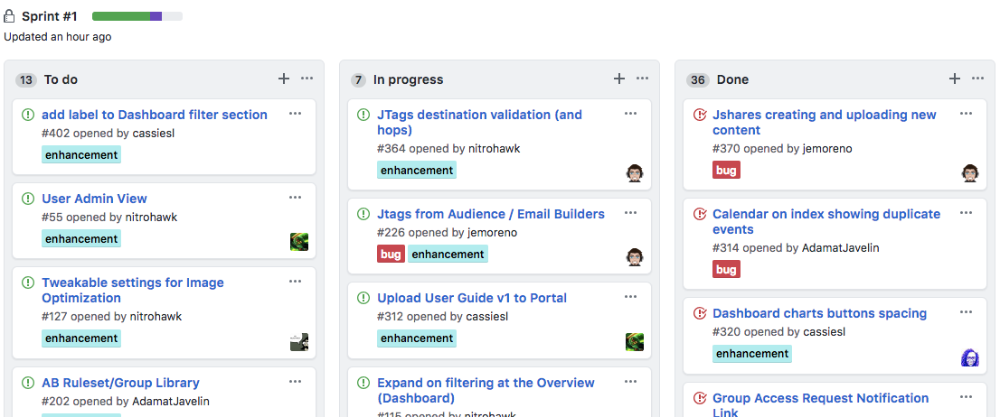

# GitHub scrum workflow

*This is a fork of the work done by jvandemo and his [documentation](https://github.com/jvandemo/github-scrum-workflow)*

Turn any GitHub repository into a simple but powerful agile work environment.

**Free**, **simple** and **fast** so you can focus on the actual coding!

**Summary:**

+ [How it works](#how-it-works)
+ [Setup Your GitHub Repository](#setup-your-github-repository)
+ [The Scrum Process Flow](#the-process-flow)
  + [1. Product Owner creates Milestones to identify Product requierments](#1-product-owner-creates-milestones-to-identify-product-requierments)
  + [2. The Development Team creates issues as Backlog Items](#2-the-development-team-creates-issues-as-backlog-items)
  + [3. Sprints are defined as GitHub Projects](#3-sprints-are-defined-as-gitHub-projects)
+ [Overview](#scrum-overview)
+ [Helpful links](#helpful-links)
+ [Change log](#change-log)

---

## How it works
- **Milestones** are used by the Product Owner to capture features for the given Product.
- Backlog Items are reported as **issues**.
- User Story Points (complexity), priority, and type are assigned to Backloag Items as **labels**.
- **Projects** are used to group **issues** into Sprints.
- The Development Team associates **issues** to **Milestones**.
- **Issues** can become their own **Milestone** if the scope is large enough to span multiple Sprints.

# Setup Your GitHub Repository

## Add labels to issues

Add the following labels to your repository:

### Priorities

`priority` labels allow you to prioritize items in your backlog e.g.:

- `priority: lowest`
- `priority: low`
- `priority: medium`
- `priority: high`
- `priority: highest`

### Points

`point` labels allow you to to assign velocity points to individual items (issues) e.g. using [Fibonacci numbers](http://en.wikipedia.org/wiki/Fibonacci_number):

- `point: 1`
- `point: 2`
- `point: 3`
- `point: 5`
- `point: 8`
- `point: 13`
- `point: 21`

### Types

`type` labels allow you to easily filter items (issues) in the dashboard e.g.:

- `type:bug`: bug
- `type:chore`: chore, maintenance work
- `type:feature`: new feature
- `type:infrastructure`: infrastructure related
- `type:performance`: performance related
- `type:refactor`: refactor
- `type:test`: test related

### Other

You can define and assign custom labels that you need within your workflow or organization.
This allows the Development Team to group items in sprints and track progress inside your repostory via the GitHub Projects view as well as GitHub Milestones.

# The Process Flow

## 1. Product Owner creates Milestones to identify Product requierments

The Product owner creates a Milestone to identify the Product feature. The Product Owner is also responsible for creating a parent **issue** further defining feature requierments.

## 2. The Development Team creates issues as Backlog Items

To create a new backlog item, simply create a new issue and assign it the associated **Milestone**. Also assign correct labels, specifying the points (complexity) and type. It is the Product Owner's responsiblity to specify priority.

Issues allow the Development Team to have a conversation about the item. You can create task lists inside the issue using [GitHub's markdown](https://guides.github.com/features/mastering-markdown/) to help better orianize the solution to the task.

## 3. Sprints are defined as GitHub Projects

The Scrum Master creates a **Project** for every Sprint. During the planning phase of the Sprint, the devlopment team places backlog items (**issues**) into the "To Do" bucket. As members of the Deveopment Team start to work on an **issue** it is moved into the "In Progress" bucket. The same goes for when an **issue** is completed. *GitHub has simple **Project** automations that move items to the Done bucket when an issue is closed.*

The Product Backlog then consists of all items (issues) that have no `project` attached to it.

**TIP**: Use `no:project` in the search field on your [issue dashboard](https://github.com/issues) to find unasigned Backlog items.

## Scrum Overview

Image: [Scrum primer](http://www.scrumprimer.org/overview).

## Helpful links

- [Mastering GitHub issues](https://guides.github.com/features/issues/)
- [Mastering GitHub markdown](https://guides.github.com/features/mastering-markdown/)
- [GitHub Flavored Markdown](https://help.github.com/articles/github-flavored-markdown/)

## Change log

### v1.0.0

- Added documentation for issues, labels and milestones.

### v1.0.1

- Added summary

### v1.1.0

- Reorganized GitHub feature usage to better aling with Scrum methodology